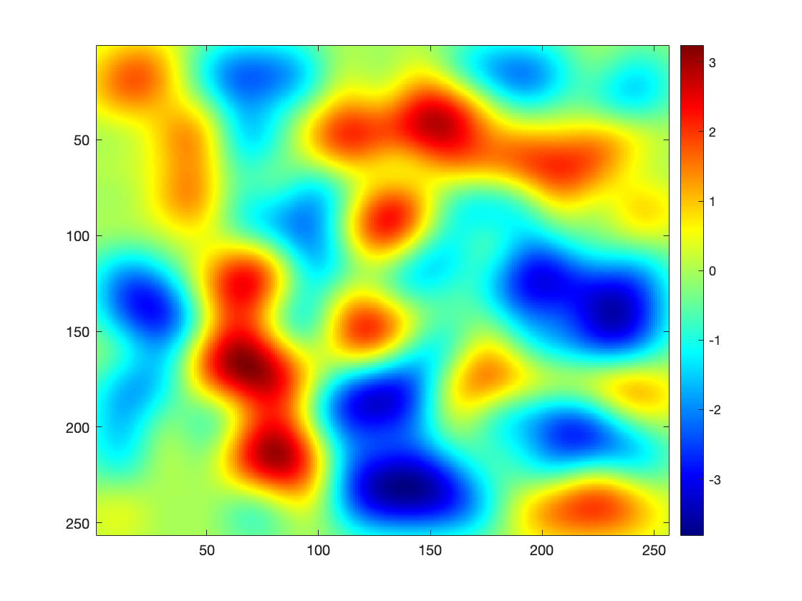
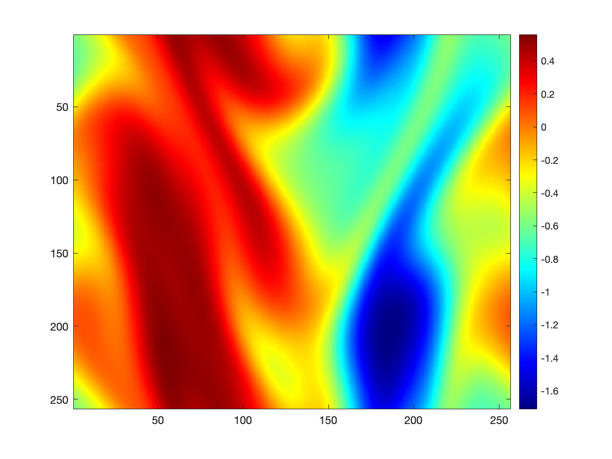
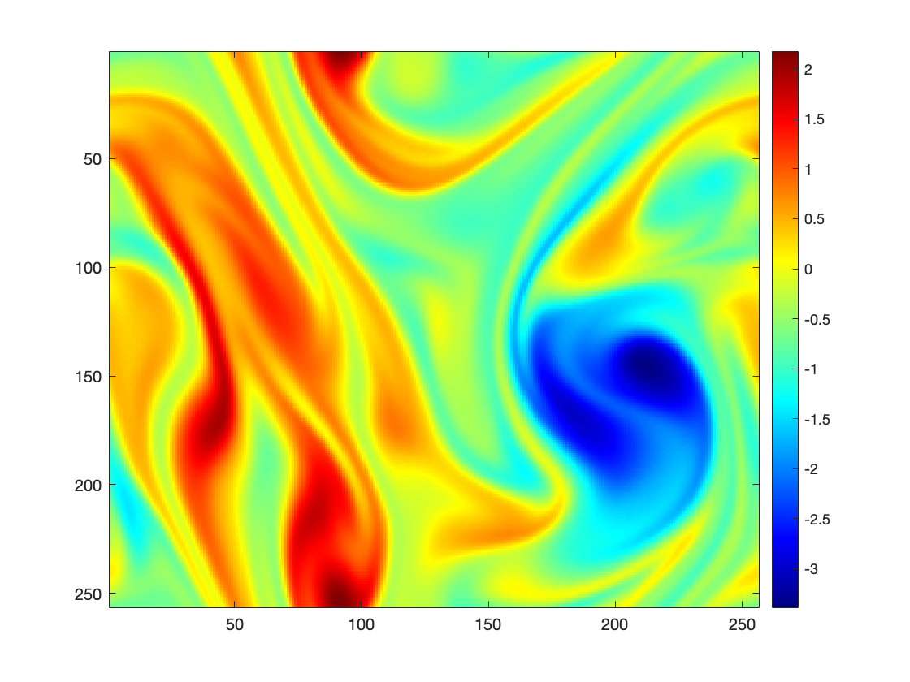

# Pseudo-Spectral Methods for Solving the 2D Incompressible Forced Navier-Stokes Equation

## Abstract

This repository presents a numerical implementation of a pseudo-spectral method for solving the 2D incompressible forced Navier-Stokes equations. The implementation focuses on simulating fluid dynamics with various viscosity parameters to investigate the transition between laminar and turbulent flow regimes. The study employs Fourier spectral methods with Crank-Nicolson time integration to achieve high spatial accuracy and numerical stability.

## 1. Mathematical Formulation

### 1.1 Incompressible Navier-Stokes Equations

The incompressible Navier-Stokes equations in 2D are given by:

$$\frac{\partial \mathbf{u}}{\partial t} + \mathbf{u} \cdot \nabla \mathbf{u} + \nabla p = \nu \Delta \mathbf{u} \tag{1}$$

$$\nabla \cdot \mathbf{u} = 0 \tag{2}$$

where:
- $\mathbf{u} = (u, v)$ is the velocity field
- $p$ is the pressure
- $\nu$ is the kinematic viscosity
- $\Delta$ is the Laplacian operator

The nonlinear term $\mathbf{u} \cdot \nabla \mathbf{u}$ represents the inertial forces, while $\nu \Delta \mathbf{u}$ represents the viscous diffusion term.

### 1.2 Vorticity Formulation

To eliminate the pressure term, we take the curl of equation (1) to derive the vorticity equation. In 2D, the vorticity $\omega$ is defined as:

$$\omega = \frac{\partial v}{\partial x} - \frac{\partial u}{\partial y}$$

Applying the curl operator to equation (1) yields:

$$\frac{\partial \omega}{\partial t} + (\mathbf{u} \cdot \nabla)\omega - (\omega \cdot \nabla)\mathbf{u} = \nu \Delta \omega \tag{3}$$

In 2D, the term $(\omega \cdot \nabla)\mathbf{u}$ vanishes, simplifying to:

$$\frac{\partial \omega}{\partial t} = \nu \Delta \omega - (\mathbf{u} \cdot \nabla)\omega \tag{4}$$

### 1.3 Stream Function Approach

The stream function $\psi$ is introduced to automatically satisfy the incompressibility condition. The relationships are:

$$\omega = -\Delta \psi \tag{5}$$

$$u = \frac{\partial \psi}{\partial y}, \quad v = -\frac{\partial \psi}{\partial x} \tag{6}$$

This formulation reduces the problem to solving for the vorticity field $\omega$, from which the velocity field $\mathbf{u}$ can be recovered via the stream function.

## 2. Numerical Implementation

### 2.1 Spatial Discretization

The spatial domain is discretized using a uniform square grid with periodic boundary conditions:
- Domain: $[0, 2\pi] \times [0, 2\pi]$
- Grid points: $N = 2^9 = 512$
- Grid spacing: $h = L/N$ where $L = 2\pi$

### 2.2 Fourier Transform Method

The vorticity equation is solved in Fourier space. Taking the Fourier transform of equation (4):

$$\frac{\partial \hat{\omega}}{\partial t} = -\nu(k_x^2 + k_y^2)\hat{\omega} - \widehat{\mathbf{u} \cdot \nabla \omega} \tag{7}$$

where:
- $\hat{\omega}$ denotes the Fourier transform of $\omega$
- $k_x, k_y$ are the wavenumbers in $x$ and $y$ directions
- The wavenumber vector is: $\mathbf{k} = (k_x, k_y)$

The wavenumbers are defined as:
$$k_x, k_y = \frac{2\pi i}{L} \times [0, 1, 2, \ldots, N/2-1, -N/2, -N/2+1, \ldots, -1]$$

### 2.3 Temporal Discretization

The time integration uses the Crank-Nicolson scheme for stability:

$$\hat{\omega}^{n+1} = \frac{\left(\frac{1}{\Delta t} + \frac{1}{2}\nu|\mathbf{k}|^2\right)\hat{\omega}^n - \widehat{(\mathbf{u} \cdot \nabla \omega)}^n}{\frac{1}{\Delta t} - \frac{1}{2}\nu|\mathbf{k}|^2} \tag{8}$$

where $|\mathbf{k}|^2 = k_x^2 + k_y^2$.

### 2.4 Stability Condition

The time step is adaptively controlled using the CFL condition:

$$\Delta t \leq \frac{h}{\|\mathbf{u}\|_\infty} \tag{9}$$

where $\|\mathbf{u}\|_\infty$ is the maximum velocity magnitude in the domain.

## 3. Algorithm

The complete algorithm follows these steps:

**Algorithm 1: Fourier-Spectral Method for Vorticity Equation**

1. Initialize vorticity field $\omega_0(x,y)$ and compute $\hat{\omega} = \text{FFT2}(\omega_0)$
2. **While** $t < T$:
   
   a. Compute stream function: $\hat{\psi} = -\frac{\hat{\omega}}{k_x^2 + k_y^2}$
   
   b. Recover velocity field:
      - $u = \text{IFFT2}(ik_y \cdot \hat{\psi})$
      - $v = \text{IFFT2}(-ik_x \cdot \hat{\psi})$
   
   c. Compute vorticity gradients:
      - $\omega_x = \text{IFFT2}(ik_x \cdot \hat{\omega})$
      - $\omega_y = \text{IFFT2}(ik_y \cdot \hat{\omega})$
   
   d. Calculate advection term: $\widehat{\mathbf{u} \cdot \nabla \omega} = \text{FFT2}(u \cdot \omega_x + v \cdot \omega_y)$
   
   e. Determine adaptive time step: $\Delta t = \frac{h}{\|\mathbf{u}\|_\infty}$
   
   f. Update vorticity using Crank-Nicolson scheme (equation 8)
   
   g. Advance time: $t = t + \Delta t$

3. **End while**

## 4. Initial Conditions

The initial vorticity field is constructed using multiple Gaussian distributions:

$$\omega_0(x,y) = \sum_{i=1}^{n} \sum_{j=1}^{n} \varepsilon_{ij} \exp\left(-\frac{(x-x_i)^2 + (y-y_j)^2}{\sigma^2}\right) \tag{10}$$

where:
- $n = 15$ (number of Gaussians in each direction)
- $\sigma = 0.5$ (standard deviation)
- $\varepsilon_{ij} \in \{-1, +1\}$ (random sign)
- $\text{spacing} = \frac{L}{n+1}$
- $x_i = i \times \text{spacing}$, $y_j = j \times \text{spacing}$

<p align="center">
  
</p>
<p align="center"><em>Figure 1: Initial Vorticity</em></p>

## 5. Simulation Parameters

| Parameter | Symbol | Value |
|-----------|---------|--------|
| Domain Size | $[0, 2\pi] \times [0, 2\pi]$ | $2\pi \times 2\pi$ |
| Grid Points | $N$ | $2^9 = 512$ |
| Simulation Time | $T$ | $15$ |
| Viscosity | $\nu$ | $0.01, 0.001$ |
| Gaussian Number | $n$ | $15$ |
| Gaussian Width | $\sigma$ | $0.5$ |

## 6. Results and Analysis

### 6.1 Vorticity Evolution

<table>
  <tr>
    <td align="center">
      <br/>
      <em>Figure 2a: Vorticity at T = 15" for ν = 0.01 (diffusive behavior)</em>
    </td>
    <td align="center">
      <br/>
      <em>Figure 2b: Vorticity at T = 15" for ν = 0.001 (turbulent behavior)</em>
    </td>
  </tr>
</table>

The simulations demonstrate distinct behavior depending on viscosity:

**High Viscosity** ($\nu = 0.01$):
- Enhanced diffusive behavior leading to smoother vorticity structures
- Lower vorticity intensities due to increased dissipation
- Flow structures exhibit more regular, less chaotic patterns

**Low Viscosity** ($\nu = 0.001$):
- Complex, turbulent-like behavior with sharp vortical structures
- Higher vorticity intensities with reduced dissipation
- Emergence of small-scale features and vortex interactions

### 6.2 Flow Transition Analysis

The temporal evolution of the vorticity field reveals the transition from initial organized structures to increasingly complex flow patterns. At lower viscosities, the flow exhibits characteristics typical of two-dimensional turbulence, including:

- Formation of coherent vortical structures
- Vortex-vortex interactions and merging events
- Development of energy cascades
- Emergence of fine-scale turbulent features

## 8. Usage Instructions

### 8.1 Running the Simulation
```matlab
% Execute the main simulation
simulation.m
```

### 8.2 Parameter Modification
To modify simulation parameters, edit the following variables in `simulation.m`:
- `viscosity`: Adjust for different flow regimes
- `N`: Change grid resolution (must be power of 2)
- `T`: Modify simulation duration
- `sigma`: Alter initial vorticity structure scale

### 8.3 Output Files
The simulation generates:
- `Simulation.avi`: Video of vorticity field evolution
- Final vorticity field visualization

## 9. References

1. Lauber, M. (2020). *2D Turbulence Simulation*. Available at: https://marinlauber.github.io/2D-Turbulence/

## 10. Acknowledgments

This work was supported by the James Stewart Award at McMaster University, Department of Mathematics. The implementation builds upon established pseudo-spectral methods for fluid dynamics simulations and was conducted under the supervision of Dr. Nicholas Kevlahan, Professor in the Department of Mathematics at McMaster University.
